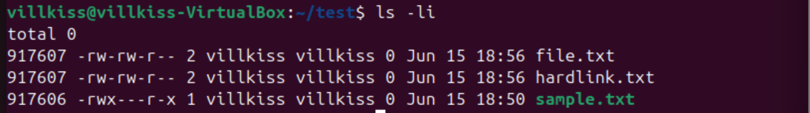
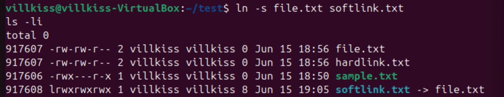

# File Permissions, Hard Links, and Symbolic Links

This lab demonstrates Linux file permission management, access control mechanisms, and the creation of hard and symbolic links.

## Topics Covered

- File ownership and permissions
- Symbolic permission notation
- Octal permission notation
- Access control using `chmod`
- Hard links
- Symbolic links
- Inode inspection using `ls -i`

## Skills Demonstrated

- Managing Linux file permissions
- Using symbolic and octal permission modes
- Understanding file ownership and access rights
- Creating and managing hard links
- Creating and managing symbolic links
- Analyzing inode numbers and link counts

## Screenshots

### File Permission Management

Demonstrates changing file permissions and verifying access rights using `ls -l`.


---

### Symbolic Permission Changes

Demonstrates modifying permissions using symbolic notation.


---

### Octal Permission Changes

Demonstrates modifying permissions using octal notation.


---

### Hard Link Creation

Demonstrates creating a hard link using the `ln` command.


---

### Hard Link Inode Verification

Shows that the original file and hard link share the same inode number and link count.



---

### Symbolic Link Demonstration

Shows the creation of a symbolic link and its relationship to the original file.



## Key Observations

### Hard Links

- Share the same inode as the original file.
- Increase the link count of the original file.
- Remain accessible even if one link is removed.

### Symbolic Links

- Have a different inode from the target file.
- Store a reference path to the target file.
- Become invalid if the target file is deleted.

### Linux Permissions

- `r` = Read
- `w` = Write
- `x` = Execute

Permissions can be managed using:

- Symbolic notation (`chmod u=rwx,o=rx file.txt`)
- Octal notation (`chmod 705 file.txt`)

## Commands Used

```bash
chmod u=rwx,o=rx sample.txt
chmod 705 sample.txt

ln file.txt hardlink.txt
ln -s file.txt softlink.txt

ls -l
ls -li
