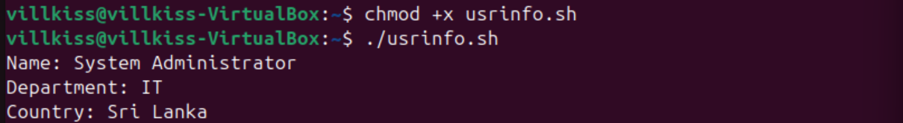
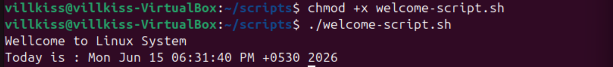

# Environment Variables and Shell Scripts

This lab demonstrates fundamental Linux shell scripting concepts, including environment variables, user-defined variables, script execution permissions, and command execution.

## Files

### usrinfo.sh
Demonstrates variable declaration and formatted output using Bash variables.

### welcome-script.sh
Displays a welcome message and the current system date and time.

## Skills Demonstrated

- Bash scripting
- Environment variables
- User-defined variables
- Script execution permissions
- Command substitution
- Linux command-line operations

## Screenshots

### usrinfo.sh Execution

### welcome-script.sh Execution

