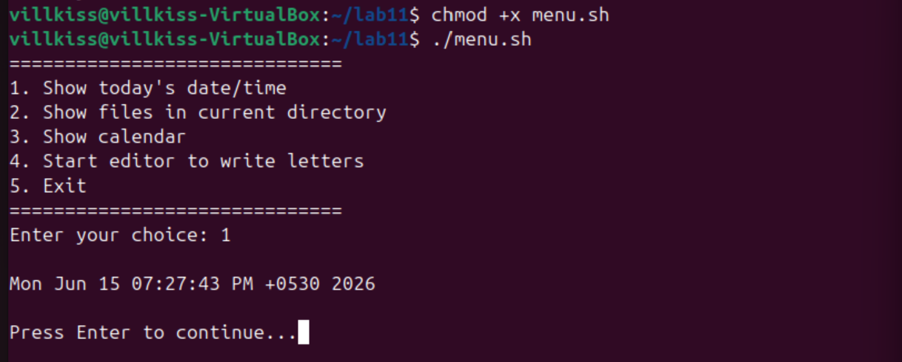
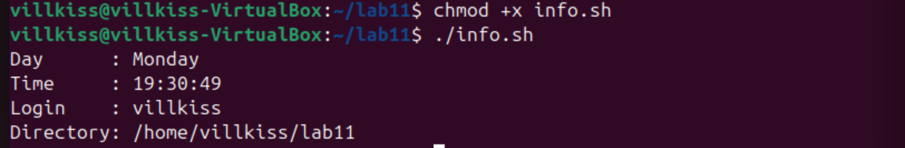

# Bash Scripting

This lab demonstrates practical Bash scripting techniques including menu-driven programs, command-line argument processing, and function usage.

## Files

### menu.sh
Menu-driven shell script for executing common Linux commands.

### biggest.sh
Determines the largest value among three command-line arguments.

### info.sh
Uses a Bash function to display system information including day, time, user login, and current working directory.

## Skills Demonstrated

- Bash scripting
- User input handling
- Conditional statements
- Loops
- Case statements
- Functions
- Command-line arguments
- System information retrieval

## Screenshots

### Menu Driven Script

### Command Line Arguments

### Bash Function

